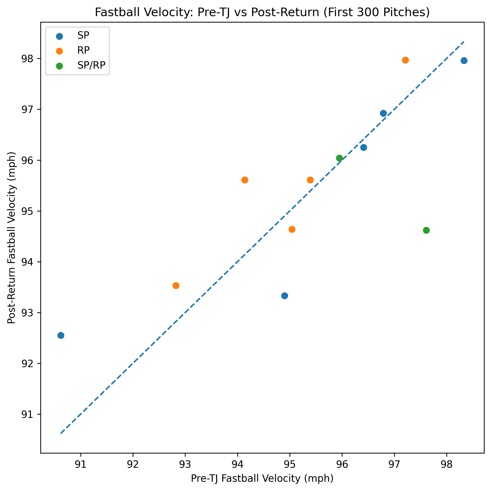
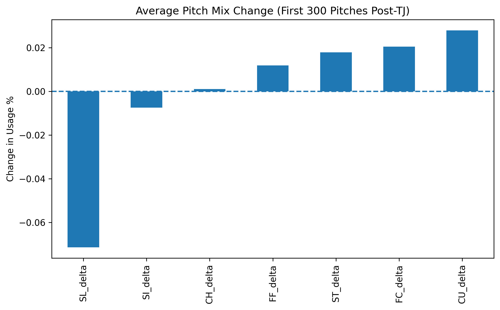

**Tommy John Surgery: Early Velocity & Pitch Mix Changes**

**Research Question:**
How does fastball velocity and pitch usage change in the first 300 pitches following a pitchers return from Tommy John s urgery, relative to the pitchers final 300 pitches pre-surgery?

**Data and Cohort:** 
- 15 MLB pitchers 
- Ages 23-28
- 12 included in final analysis (3 excluded due to insufficient pitch counts)
- MLB Statcast pitch-level data
- Window definition:
  - Last 300 pitches pre-TJ
  - First 300 pitches post-TJ

**Methodology**
- Pulled pitch-level data using 'pybaseball'
- Windowed by pitch count, not calendar time
- Calculated: 
  - Four-seam fastball velocity mean
  - Pitch usage % by pitch type
- Computed deltas (Post - Pre) 
- Excluded pitchers with insufficient pitch counts

**Results:**

**Fastball Velocity** 
- Average change: −0.01 mph

**Pitch Mix** 
- Slider usage decreased by ~ -7.1 percentage points
- Curveball usage increased by ~ 2.8 percentage points
- No strong subgroup conclusions drawn due to sample size

**Interpretation**
- Early return windows show that pitchers, even though it is moderate, consistently reduce slider usage while increasing curveball usage. This could be due to mechanical adjustment, strategic adaptation, or recovery management. These findings are descriptive and do not imply causation. 

**Limitations**
- Sample size (n=12)
- Selection bias towards pitchers who returned successfully
- Role changes not deeply analyzed
- No performance metrics included (ERA, Whiff, etc.)

**Future Work:**
- Expand cohort size
- Analyze movement changes
- Add performance metrics
- Examine longer-term windows (Pre and Post)

## How to run
pip install -r requirements.txt
python scripts/tj_analysis.py

Outputs saved to /outputs

Cohort CSV located in /data